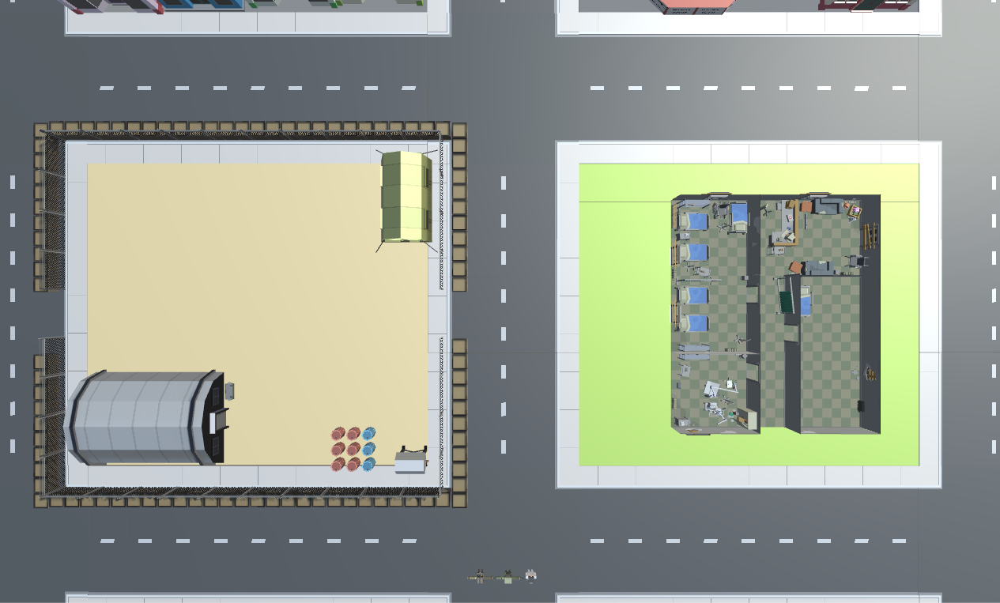
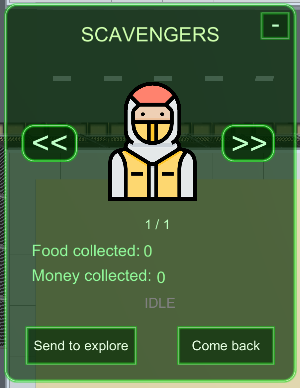

# Chase The Cure
* Version 0.3 (Final): [Last Build](https://github.com/AitorSimona/ChaseTheCure/releases/download/0.3/ChaseTheCure_v0.3.zip)
* GitHub repository: [Repository](https://github.com/AitorSimona/ChaseTheCure)
* GitHub Wiki: [Wiki](https://github.com/AitorSimona/ChaseTheCure/wiki)

Due to Assets license, repo is kept private, you won't be able to access it, click Last Build to download latest release!

A Virus has spread around, you have to find a cure.
Keep people alive, keep PANIC in check, good luck.

<video src="docs/Chase The Cure_Gameplay.mp4" width="600" height="500" controls preload></video>

## Understanding Chase The Cure

***

### Check how far, or close, are you from winning/losing through the Cure/Panic progress bars

***

### Watch over how many food you have left, agents will die from starvation if it gets down to 0! Also check your money count!

***

### Defend what is yours! 

***

### You can expand available agent space!

***

### You can change an agent's role through the ASSIGN ROLE Menu (top-right), there is a maximum number of agents per type.
### Each agent has its own Skills:
  * Intelligence: Boosts scientist's effectiveness
  * Agility: Boost's scavenger's effectiveness. 
  * Strength: Boost's soldier's effectiveness

***

### You can send scavengers to explore. You can only make them return once they have reached their destination. Scavengers accumulate food and money while scavenging, choose wisely when to make them come back. 

***

### Newcomers are sent in every X seconds, you can either discard them or assign them to a role. Check their attributes to see where they fit the best. Are they super intelligent? Make them scientists!

### Mind sickness! Agents will eventually die from it!

***

## Authors:

Aitor Simona & Joan Marín

* GitHub account: [AitorSimona](https://github.com/AitorSimona)

  * Contribution:
    * Custom Steering behaviours
    * Character Controllers (skills...)
    * Behaviour Trees 
    * Everything related to graphs (Animations, actions...) 
    * Website 
    * Game logic (alert state, combat...)
    * Some of the UI (cure & panic, food & money, skill bars)
 
* GitHub account: [JoanMarín](https://github.com/X0KA)

  * Contribution:
    * UI / Graphics
    * Level / Transition Menu-Level 
    * Audio
   
The rest was co-developed.   

We do not own any of the assets you can see on screen, all rights go to their respective creators

***

## TOOLS USED

- Microsoft Visual Studio 2017
- Unity 2019.11f1

***

## AI Behaviour Trees

* Soldiers: Patrol the settlement, defend the outpost where the food warehouse is. 
   * Patrol: Soldiers patrol the roads, following a curve
   * Alert: Soldiers head to the food warehouse to protect it from assailants
   * Attack: Soldiers attack any assailant inside the attack radius, every given amount of time, they reduce enemy's HP

> Flow: Soldiers will check for the alarm, if it is OFF they will patrol, and stop at each patrol end point for some time. If the alarm is triggered they will check for enemies around, if none is detected they will head towards the food warehouse in the outpost. Once there, they will stop and wait for the attackers, killing them when they get on range.

* Scavengers: Can be sent out to gather food.
   * Patrol: Scavengers leave the settlement to look for food, and store it in the food warehouse
   * Idle: Scavengers stay put

> Flow: Scavengers will await player orders, if scavenge is issued they will leave the base. Once they reach their destination they can be asked to come back, they will head to the food warehouse and await further orders. 

* Scientists: Research a cure to the virus.
   * Patrol: Scientists move around the hospital investigating a cure
   * Idle: Scientists stay put
   * Alert: Scientists head to the living room in the hospital to hide from assailants

> Flow: Scientists will research the cure inside the hospital, stopping at patrol end points. If the alarm is triggered, they will head to hide position inside the empty hospital room.

* Assailants: Attack the settlement to steal food 
   * Alert: Assailants head to the food warehouse to steal food

> Flow: Assailants head to the food warehouse to steal food. If not killed they will continue to steal it.

* Newcomers: Come to ask for asylum and offer help  (same BT as assailants)
   * They just await player's orders, die from starvation after a given period of time

> Flow: They await role assignment, can also be exiled with KICK button

